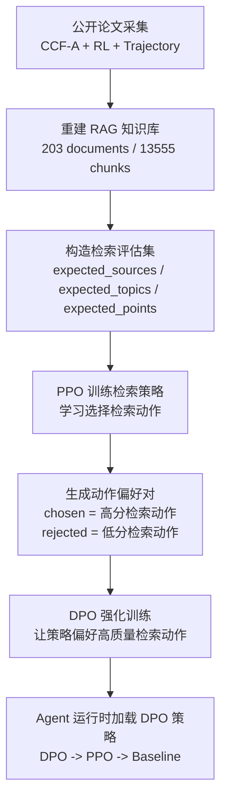

# PPO + DPO 强化 Agent 检索策略总结

## 目标

提升本地 Agent 在“强化学习 + 轨迹”论文知识库中的检索质量，让回答前能更准确命中相关论文来源与研究主题。

## 数据基础

| 项目 | 数量 |
|---|---:|
| 公开 CCF-A 相关 PDF | 200 |
| 知识库文档 | 203 |
| 知识库 Chunk | 13555 |
| 强化学习相关文档 | 170 |
| PPO 相关文档 | 83 |

## 训练流程



## 训练方式

PPO 将检索建模为强化学习任务：

```text
State: 用户问题特征
Action: baseline / broad_search / paper_focus / planning_focus / reward_focus 等检索动作
Reward = 0.5 * Source Hit + 0.3 * Topic Hit + 0.2 * Point Recall
```

DPO 在 PPO 后继续训练：

- 枚举每个问题的多个检索动作
- 指标更好的动作作为 `chosen`
- 指标更差的动作作为 `rejected`
- 共构造 `242` 条偏好对
- 训练策略更偏好高 Source Hit / Topic Hit 的动作

## 核心指标

| 指标 | 含义 |
|---|---|
| Source Hit | 检索结果是否命中标准论文/来源 |
| Topic Hit | 检索结果是否覆盖标准主题标签 |
| Point Recall | 检索片段是否覆盖答案关键点 |

## 训练效果

| 指标 | Baseline | PPO | DPO |
|---|---:|---:|---:|
| Source Hit | 0.3056 | 0.3056 | 0.4444 |
| Topic Hit | 0.8704 | 0.9144 | 0.9560 |
| Reward | 0.5028 | 0.4893 | 0.5928 |

## DPO 相比 Baseline 的提升

| 指标 | 提升 |
|---|---:|
| Source Hit | +0.1388 |
| Topic Hit | +0.0856 |
| Reward | +0.0900 |
| Point Recall | +0.0787 |

## 结论

DPO 强化后的检索策略显著提升了 Agent 对正确论文来源和研究主题的命中率。当前系统运行时优先加载：

```text
outputs/retrieval_policy_dpo_torch/retrieval_policy_dpo.pt
```

因此，Agent 已从普通检索升级为“基于 PPO + DPO 的强化检索策略”。
